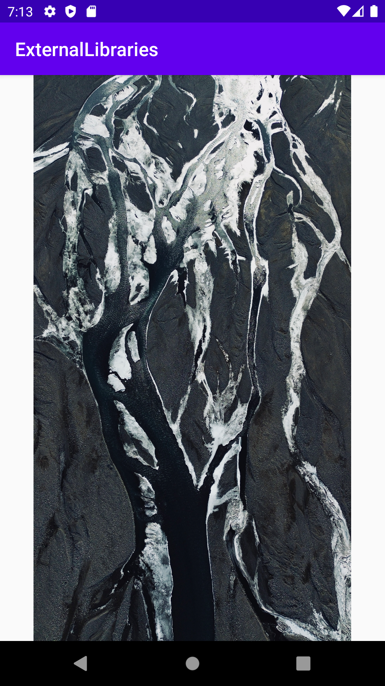

# Rapport

Det valda externa bibloteket som används i detta projekt är [Picasso](https://square.github.io/picasso/). För att använda bibloteket så lades det till som depenedency i build.gradle(Module :app) filen (se kod nedan).

```
dependencies {
    implementation fileTree(dir: 'libs', include: ['*.jar'])
    implementation 'androidx.appcompat:appcompat:1.1.0'
    implementation 'androidx.constraintlayout:constraintlayout:1.1.3'
    testImplementation 'junit:junit:4.12'
    androidTestImplementation 'androidx.test.ext:junit:1.1.1'
    androidTestImplementation 'androidx.test.espresso:espresso-core:3.2.0'
    implementation 'com.squareup.picasso:picasso:2.71828'
}
```

Picasso kan användas för att hämta en bild från t.ex. en assets mapp eller internet för att användas i en `ImageView`. I kodstycket nedan visas en `ImageView` som lagts till `MainActivity` genom att redigera `activity_main.xml`.

```xml
    <ImageView
        android:id="@+id/picasso_imageview"
        android:layout_width="match_parent"
        android:layout_height="match_parent"
        app:layout_constraintBottom_toBottomOf="parent"
        app:layout_constraintLeft_toLeftOf="parent"
        app:layout_constraintRight_toRightOf="parent"
        app:layout_constraintTop_toTopOf="parent" />
```

Eftersom `Picasso` kan användas för att hämta bilder från internet så behöver applikationen ha tillstånd att nå internet. Detta tillstånd lades till i `AndroidManifest.xml` (se kod nedan).

```xml
    <uses-permission android:name="android.permission.INTERNET" />
```

I kodstycket nedan visas implementerad kod från `MainActivity` som skapar ett `Picasso` objekt och sedan hämtar en bild med hjälp av en URL till [Unsplash](https://unsplash.com/). Denna bild läggs sedan till ett `ImageView` objekt som refererar till den `ImageView` som lagts till i `main_activity.xml`.  

```java
        ImageView picassoImageView = findViewById(R.id.picasso_imageview);
        Picasso.get()
                .load("https://images.unsplash.com/photo-1679498819175-9b2bc1df5ccf")
                .into(picassoImageView);
```


När applikationen startar så laddas bilden ner och visas för användaren. Nedan visas en bild på hur applikationen ser ut.


